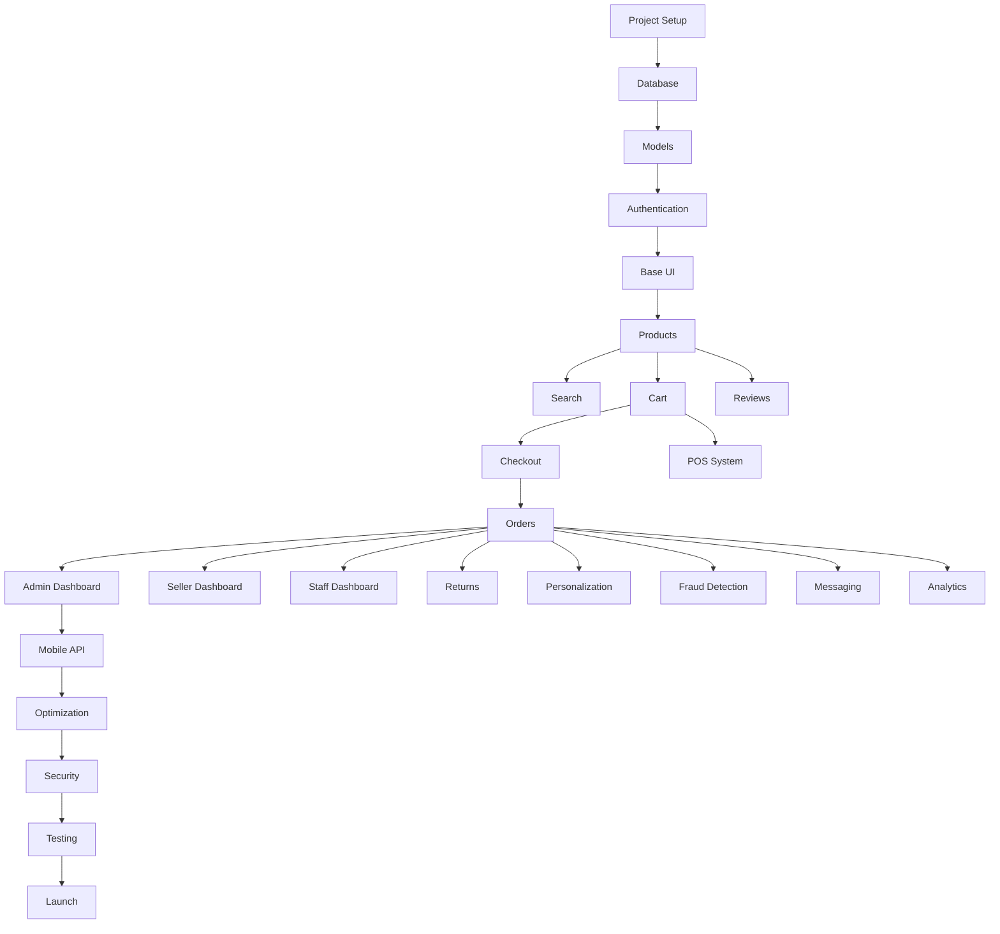

# Implementation Roadmap

## [AI-REF] Complete Task List & Development Phases

This document provides a detailed breakdown of all implementation tasks.

---

## Phase Overview

| Phase | Focus | Duration |
|-------|-------|----------|
| Phase 1 | Foundation & Setup | Weeks 1-4 |
| Phase 2 | Core E-Commerce | Weeks 5-10 |
| Phase 3 | Dashboards & POS | Weeks 11-16 |
| Phase 4 | Intelligence & Integration | Weeks 17-22 |
| Phase 5 | Mobile & Optimization | Weeks 23-28 |

---

## Phase 1: Foundation & Setup

### 1.1 Project Setup

- [ ] **PRJ-001** Initialize Laravel 11 project
- [ ] **PRJ-002** Configure environment variables (.env.example)
- [ ] **PRJ-003** Setup Docker development environment
  - [ ] PHP 8.3 container
  - [ ] MySQL 8.0 container
  - [ ] Redis container
  - [ ] Meilisearch container
- [ ] **PRJ-004** Configure Tailwind CSS 3.4+
  - [ ] Setup custom color palette
  - [ ] Configure typography
  - [ ] Setup spacing scale
  - [ ] Configure border/shadow tokens
- [ ] **PRJ-005** Setup Vite for asset compilation
- [ ] **PRJ-006** Configure Alpine.js
- [ ] **PRJ-007** Install and configure Livewire 3
- [ ] **PRJ-008** Setup Laravel Horizon for queues
- [ ] **PRJ-009** Configure Laravel Scout with Meilisearch
- [ ] **PRJ-010** Setup PHPUnit testing environment
- [ ] **PRJ-011** Configure GitHub Actions CI/CD pipeline
- [ ] **PRJ-012** Setup code quality tools (Pint, PHPStan)

### 1.2 Database Architecture

- [ ] **DB-001** Create users migration
- [ ] **DB-002** Create user_addresses migration
- [ ] **DB-003** Create user_sessions migration
- [ ] **DB-004** Create admins migration
- [ ] **DB-005** Create staff migration
- [ ] **DB-006** Create sellers migration
- [ ] **DB-007** Create seller_documents migration
- [ ] **DB-008** Create wholesalers migration
- [ ] **DB-009** Create categories migration
- [ ] **DB-010** Create brands migration
- [ ] **DB-011** Create products migration
- [ ] **DB-012** Create product_variants migration
- [ ] **DB-013** Create product_images migration
- [ ] **DB-014** Create product_attributes migration
- [ ] **DB-015** Create inventory_stocks migration
- [ ] **DB-016** Create inventory_movements migration
- [ ] **DB-017** Create carts migration
- [ ] **DB-018** Create cart_items migration
- [ ] **DB-019** Create wishlists migration
- [ ] **DB-020** Create orders migration
- [ ] **DB-021** Create order_items migration
- [ ] **DB-022** Create order_status_history migration
- [ ] **DB-023** Create payments migration
- [ ] **DB-024** Create refunds migration
- [ ] **DB-025** Create returns migration
- [ ] **DB-026** Create credit_notes migration
- [ ] **DB-027** Create coupons migration
- [ ] **DB-028** Create reviews migration
- [ ] **DB-029** Create stores migration (POS)
- [ ] **DB-030** Create pos_sales migration
- [ ] **DB-031** Create conversations migration
- [ ] **DB-032** Create messages migration
- [ ] **DB-033** Create notifications migration
- [ ] **DB-034** Create settings migration
- [ ] **DB-035** Create all pivot table migrations
- [ ] **DB-036** Create database seeders
  - [ ] Settings seeder
  - [ ] Categories seeder
  - [ ] Brands seeder
  - [ ] Admin user seeder
  - [ ] Test data seeder (dev only)

### 1.3 Eloquent Models

- [ ] **MDL-001** User model with traits (HasUuid, etc.)
- [ ] **MDL-002** UserAddress model
- [ ] **MDL-003** Admin model
- [ ] **MDL-004** Staff model
- [ ] **MDL-005** Seller model
- [ ] **MDL-006** Wholesaler model
- [ ] **MDL-007** Category model (nested set)
- [ ] **MDL-008** Brand model
- [ ] **MDL-009** Product model with search
- [ ] **MDL-010** ProductVariant model
- [ ] **MDL-011** ProductImage model
- [ ] **MDL-012** ProductAttribute model
- [ ] **MDL-013** InventoryStock model
- [ ] **MDL-014** Cart model
- [ ] **MDL-015** CartItem model
- [ ] **MDL-016** Wishlist model
- [ ] **MDL-017** Order model
- [ ] **MDL-018** OrderItem model
- [ ] **MDL-019** Payment model
- [ ] **MDL-020** Refund model
- [ ] **MDL-021** Return model
- [ ] **MDL-022** CreditNote model
- [ ] **MDL-023** Coupon model
- [ ] **MDL-024** Review model
- [ ] **MDL-025** Store model
- [ ] **MDL-026** PosSale model
- [ ] **MDL-027** Conversation model
- [ ] **MDL-028** Message model
- [ ] **MDL-029** Notification model
- [ ] **MDL-030** Setting model

### 1.4 Authentication System

- [ ] **AUTH-001** Setup Laravel Sanctum
- [ ] **AUTH-002** Create registration flow
  - [ ] Registration form request
  - [ ] Registration action
  - [ ] Email verification
- [ ] **AUTH-003** Create login flow
  - [ ] Login form request
  - [ ] Login action with rate limiting
  - [ ] Session management
- [ ] **AUTH-004** Password reset flow
- [ ] **AUTH-005** Phone OTP verification
- [ ] **AUTH-006** Two-factor authentication
- [ ] **AUTH-007** Social login (Google, Facebook)
- [ ] **AUTH-008** API token authentication
- [ ] **AUTH-009** Role-based middleware
- [ ] **AUTH-010** Session fingerprinting security

### 1.5 Base UI Components

- [ ] **UI-001** Create base layout (app.blade.php)
- [ ] **UI-002** Create header component
- [ ] **UI-003** Create footer component
- [ ] **UI-004** Create navigation component
- [ ] **UI-005** Create button components (primary, secondary, ghost)
- [ ] **UI-006** Create input components
- [ ] **UI-007** Create select/dropdown components
- [ ] **UI-008** Create modal component
- [ ] **UI-009** Create card component
- [ ] **UI-010** Create badge component
- [ ] **UI-011** Create alert/notification component
- [ ] **UI-012** Create loading spinner component
- [ ] **UI-013** Create pagination component
- [ ] **UI-014** Create breadcrumb component
- [ ] **UI-015** Create icon component library (SVG)
- [ ] **UI-016** Create form validation display
- [ ] **UI-017** Create toast notification system

---

## Phase 2: Core E-Commerce

### 2.1 Product Catalog

- [ ] **PROD-001** Product listing page
  - [ ] Grid/list view toggle
  - [ ] Responsive grid layout
  - [ ] Product card component
  - [ ] Lazy loading images
- [ ] **PROD-002** Product detail page
  - [ ] Image gallery with zoom
  - [ ] Variant selector
  - [ ] Price display
  - [ ] Stock status
  - [ ] Add to cart
  - [ ] Add to wishlist
  - [ ] Breadcrumbs
- [ ] **PROD-003** Category pages
  - [ ] Category navigation
  - [ ] Nested category display
  - [ ] Category banner
- [ ] **PROD-004** Brand pages
- [ ] **PROD-005** New arrivals page
- [ ] **PROD-006** Featured products section
- [ ] **PROD-007** Deals/offers page
- [ ] **PROD-008** Product comparison (basic)

### 2.2 Search & Filtering

- [ ] **SRCH-001** Setup Meilisearch index
  - [ ] Configure searchable attributes
  - [ ] Configure filterable attributes
  - [ ] Setup ranking rules
  - [ ] Configure synonyms
- [ ] **SRCH-002** Search service implementation
- [ ] **SRCH-003** Search results page
- [ ] **SRCH-004** Autocomplete component
  - [ ] Product suggestions
  - [ ] Category suggestions
  - [ ] Brand suggestions
  - [ ] Recent searches
- [ ] **SRCH-005** Faceted filtering
  - [ ] Category filter
  - [ ] Brand filter
  - [ ] Price range slider
  - [ ] Rating filter
  - [ ] Dynamic attribute filters
- [ ] **SRCH-006** Sort options
- [ ] **SRCH-007** Filter count updates
- [ ] **SRCH-008** Zero results handling
- [ ] **SRCH-009** Search analytics logging

### 2.3 Cart System

- [ ] **CART-001** Cart service implementation
- [ ] **CART-002** Add to cart action
- [ ] **CART-003** Update quantity action
- [ ] **CART-004** Remove item action
- [ ] **CART-005** Cart page
- [ ] **CART-006** Mini cart dropdown
- [ ] **CART-007** Cart item component
- [ ] **CART-008** Coupon code application
- [ ] **CART-009** Cart totals calculation
- [ ] **CART-010** Stock validation
- [ ] **CART-011** Cart persistence (session/DB)
- [ ] **CART-012** Guest to user cart merge

### 2.4 Checkout System

- [ ] **CHK-001** Checkout flow design
- [ ] **CHK-002** Address selection/creation
- [ ] **CHK-003** Shipping method selection
- [ ] **CHK-004** Shipping rate calculation
- [ ] **CHK-005** Payment method selection
- [ ] **CHK-006** Order summary
- [ ] **CHK-007** Razorpay integration
- [ ] **CHK-008** Payment processing
- [ ] **CHK-009** Order creation action
- [ ] **CHK-010** Inventory deduction
- [ ] **CHK-011** Order confirmation page
- [ ] **CHK-012** Order confirmation email
- [ ] **CHK-013** Invoice generation
- [ ] **CHK-014** Guest checkout support

### 2.5 Order Management

- [ ] **ORD-001** Order listing page (user)
- [ ] **ORD-002** Order detail page (user)
- [ ] **ORD-003** Order status tracking
- [ ] **ORD-004** Order cancellation
- [ ] **ORD-005** Order status emails
- [ ] **ORD-006** Order history

### 2.6 User Account

- [ ] **ACC-001** Account dashboard
- [ ] **ACC-002** Profile management
- [ ] **ACC-003** Address book
- [ ] **ACC-004** Order history
- [ ] **ACC-005** Wishlist management
- [ ] **ACC-006** Change password
- [ ] **ACC-007** Account settings

### 2.7 SEO Implementation

- [ ] **SEO-001** Meta tags component
- [ ] **SEO-002** JSON-LD product schema
- [ ] **SEO-003** JSON-LD organization schema
- [ ] **SEO-004** JSON-LD breadcrumb schema
- [ ] **SEO-005** Dynamic sitemap generation
- [ ] **SEO-006** Robots.txt configuration
- [ ] **SEO-007** Canonical URLs
- [ ] **SEO-008** Open Graph tags
- [ ] **SEO-009** Twitter cards

---

## Phase 3: Dashboards & Advanced Features

### 3.1 Admin Dashboard

- [ ] **ADM-001** Admin layout
- [ ] **ADM-002** Dashboard overview
  - [ ] Revenue stats
  - [ ] Order stats
  - [ ] User stats
  - [ ] Product stats
- [ ] **ADM-003** User management
  - [ ] User list
  - [ ] User detail
  - [ ] User edit
  - [ ] User roles
- [ ] **ADM-004** Seller management
  - [ ] Seller applications
  - [ ] Seller approval
  - [ ] Seller suspension
- [ ] **ADM-005** Product management
  - [ ] Product list
  - [ ] Product approval
  - [ ] Product edit (admin)
- [ ] **ADM-006** Category management
- [ ] **ADM-007** Brand management
- [ ] **ADM-008** Order management
  - [ ] Order list
  - [ ] Order detail
  - [ ] Status updates
- [ ] **ADM-009** Review moderation
- [ ] **ADM-010** Coupon management
- [ ] **ADM-011** Settings management
- [ ] **ADM-012** Analytics/reports

### 3.2 Seller Dashboard

- [ ] **SLR-001** Seller registration flow
  - [ ] Business info
  - [ ] Document upload
  - [ ] Bank details
  - [ ] GST verification
- [ ] **SLR-002** Seller layout
- [ ] **SLR-003** Seller dashboard overview
- [ ] **SLR-004** Product management
  - [ ] Product list
  - [ ] Add product
  - [ ] Edit product
  - [ ] Image upload
  - [ ] Variant management
- [ ] **SLR-005** Inventory management
- [ ] **SLR-006** Order management
  - [ ] Order list
  - [ ] Order processing
  - [ ] Shipping labels
- [ ] **SLR-007** Sales analytics
- [ ] **SLR-008** Payout history
- [ ] **SLR-009** Seller settings

### 3.3 Staff Dashboard

- [ ] **STF-001** Staff layout
- [ ] **STF-002** Staff dashboard
- [ ] **STF-003** Order processing
- [ ] **STF-004** Customer support tools
- [ ] **STF-005** Return processing

### 3.4 Review System

- [ ] **REV-001** Review submission form
- [ ] **REV-002** Image/video upload
- [ ] **REV-003** Review display component
- [ ] **REV-004** Review listing page
- [ ] **REV-005** Helpful voting
- [ ] **REV-006** Review response (seller)
- [ ] **REV-007** Review moderation
- [ ] **REV-008** Verified purchase badge
- [ ] **REV-009** Review JSON-LD schema
- [ ] **REV-010** Q&A section

### 3.5 POS System

- [ ] **POS-001** POS API endpoints
- [ ] **POS-002** Product barcode lookup
- [ ] **POS-003** Sale creation API
- [ ] **POS-004** Payment processing
- [ ] **POS-005** Receipt generation
- [ ] **POS-006** Return processing
- [ ] **POS-007** Credit note generation
- [ ] **POS-008** Shift management
- [ ] **POS-009** Barcode generation
- [ ] **POS-010** Inventory sync

### 3.6 Returns & Refunds

- [ ] **RET-001** Return request form
- [ ] **RET-002** Return processing workflow
- [ ] **RET-003** Refund processing
- [ ] **RET-004** Credit note system
- [ ] **RET-005** Exchange workflow

### 3.7 Wholesaler Features

- [ ] **WHL-001** Wholesaler registration
- [ ] **WHL-002** GST validation
- [ ] **WHL-003** Tier-based pricing
- [ ] **WHL-004** Bulk order management
- [ ] **WHL-005** Credit limit management

### 3.8 Discount Engine

- [ ] **DSC-001** Coupon creation
- [ ] **DSC-002** Automatic discounts
- [ ] **DSC-003** Flash sales
- [ ] **DSC-004** Bulk discount rules
- [ ] **DSC-005** Non-selling product auto-discount

---

## Phase 4: Intelligence & Integration

### 4.1 Personalization

- [ ] **PRS-001** User behavior tracking
- [ ] **PRS-002** User preference analysis
- [ ] **PRS-003** Personalized rankings
- [ ] **PRS-004** Recommended products widget
- [ ] **PRS-005** Recently viewed products
- [ ] **PRS-006** Personalized homepage

### 4.2 Fraud Detection

- [ ] **FRD-001** Fraud scoring service
- [ ] **FRD-002** Device fingerprinting
- [ ] **FRD-003** Velocity checks
- [ ] **FRD-004** Address validation
- [ ] **FRD-005** Payment anomaly detection
- [ ] **FRD-006** Fraud review queue
- [ ] **FRD-007** Fraud alerts

### 4.3 Messaging Integration

- [ ] **MSG-001** WhatsApp Business API setup
- [ ] **MSG-002** WhatsApp webhook handler
- [ ] **MSG-003** Facebook Messenger integration
- [ ] **MSG-004** Instagram DM integration
- [ ] **MSG-005** Message routing system
- [ ] **MSG-006** Auto-response system
- [ ] **MSG-007** Image recognition for product matching
- [ ] **MSG-008** Message templates
- [ ] **MSG-009** Conversation management

### 4.4 Notification System

- [ ] **NTF-001** Email notification service
- [ ] **NTF-002** SMS notification service
- [ ] **NTF-003** Push notification service
- [ ] **NTF-004** In-app notifications
- [ ] **NTF-005** Notification preferences

### 4.5 Analytics & Reporting

- [ ] **ANL-001** Google Analytics 4 integration
- [ ] **ANL-002** Facebook Pixel integration
- [ ] **ANL-003** Google Tag Manager setup
- [ ] **ANL-004** Sales reports
- [ ] **ANL-005** Inventory reports
- [ ] **ANL-006** Customer reports
- [ ] **ANL-007** Export functionality

---

## Phase 5: Mobile & Optimization

### 5.1 API for Mobile

- [ ] **API-001** Mobile home endpoint
- [ ] **API-002** Product endpoints optimization
- [ ] **API-003** Cart endpoints
- [ ] **API-004** Checkout endpoints
- [ ] **API-005** User endpoints
- [ ] **API-006** Push token registration
- [ ] **API-007** API documentation

### 5.2 Performance Optimization

- [ ] **PERF-001** Database query optimization
- [ ] **PERF-002** Implement caching strategy
- [ ] **PERF-003** Image optimization (WebP)
- [ ] **PERF-004** Lazy loading implementation
- [ ] **PERF-005** Critical CSS extraction
- [ ] **PERF-006** CDN configuration
- [ ] **PERF-007** HTTP/2 push setup
- [ ] **PERF-008** Load testing
- [ ] **PERF-009** Database read replicas

### 5.3 Security Hardening

- [ ] **SEC-001** Security headers implementation
- [ ] **SEC-002** CSP configuration
- [ ] **SEC-003** Rate limiting tuning
- [ ] **SEC-004** Security audit
- [ ] **SEC-005** Penetration testing
- [ ] **SEC-006** GDPR compliance review
- [ ] **SEC-007** PCI-DSS compliance check

### 5.4 Testing & QA

- [ ] **TEST-001** Unit test suite (80%+ coverage)
- [ ] **TEST-002** Integration test suite
- [ ] **TEST-003** E2E test suite
- [ ] **TEST-004** Performance test suite
- [ ] **TEST-005** Security test suite
- [ ] **TEST-006** Accessibility testing
- [ ] **TEST-007** Cross-browser testing
- [ ] **TEST-008** Mobile device testing

### 5.5 Launch Preparation

- [ ] **LAUNCH-001** Production environment setup
- [ ] **LAUNCH-002** SSL certificate
- [ ] **LAUNCH-003** Backup strategy
- [ ] **LAUNCH-004** Monitoring setup
- [ ] **LAUNCH-005** Alerting configuration
- [ ] **LAUNCH-006** Documentation review
- [ ] **LAUNCH-007** Load testing (production-like)
- [ ] **LAUNCH-008** Rollback plan
- [ ] **LAUNCH-009** Go-live checklist

---

## Task Priority Matrix

| Priority | Label | Criteria |
|----------|-------|----------|
| P0 | Critical | Must have for MVP launch |
| P1 | High | Should have for launch |
| P2 | Medium | Nice to have for launch |
| P3 | Low | Post-launch enhancement |

---

## Dependencies

---

## Estimation Notes

- Each task = 2-8 hours depending on complexity
- Buffer 20% for unknowns
- Account for testing time in each task
- Code review adds ~30% to dev time
- Documentation adds ~10% to dev time

